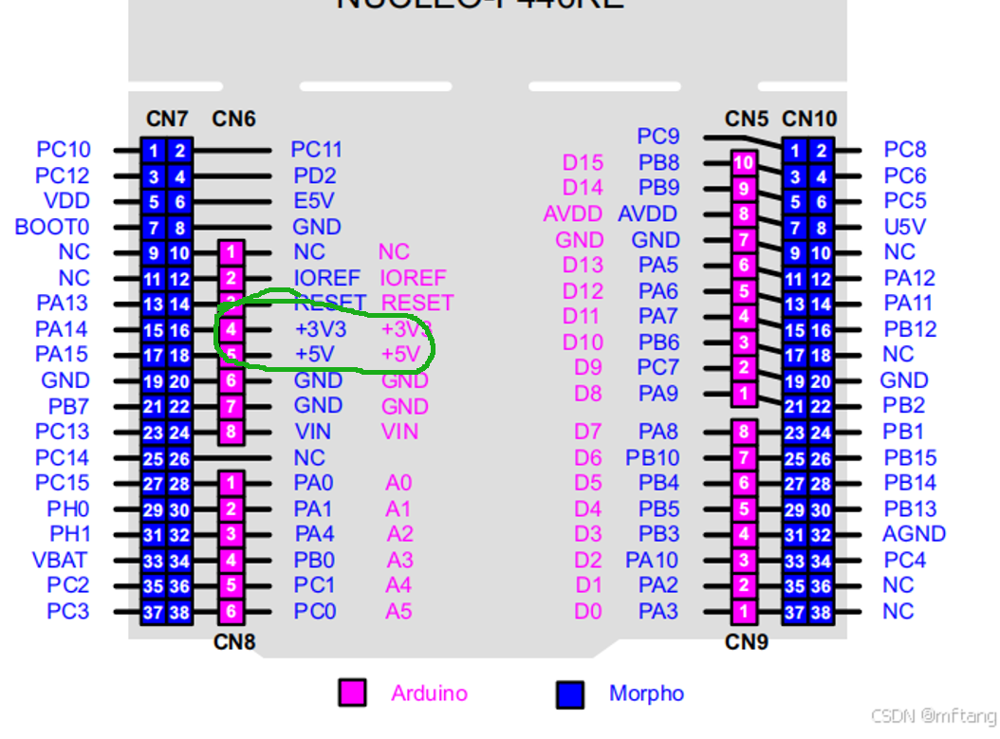

# NoeticMaze

NoeticMaze is the embedded control and navigation project used for the NUCLEO-F446RE demonstration. The system integrates lidar, IMU, wheel encoders, differential-drive motor control, ICP-based localisation, grid mapping, A* path planning, path following, Bluetooth telemetry, and FreeRTOS task scheduling.

This ZIP contains the source code, header files, generated STM32 configuration files, CMake build files, linker/startup files, and supporting resources required to compile and run the demonstrated system on the NUCLEO-F446RE.

## video

<video src="asset/【北邮果园·课程设计】基于STM32的有限算力平台的slam自动驾驶小车表现效果演示_P2_前端上位机（不参与运算）_compressed_under_25MB.mp4" width="100%" controls autoplay loop muted></video>

## Target Platform

- Board: NUCLEO-F446RE
- MCU: STM32F446RE / Cortex-M4F
- RTOS: FreeRTOS with CMSIS-RTOS v2 API
- Main build target: `NoeticMaze`
- Main output files after build: `NoeticMaze.elf`, `NoeticMaze.hex`, `NoeticMaze.bin`

## Project Folder Structure

```text
NoeticMaze/
├── App/                         # User application modules
│   ├── algorithmBrain/           # ICP, SLAM/mapping bridge, localisation and re-planning logic
│   ├── global/                   # Shared robot state, global configuration and runtime parameters
│   ├── imu/                      # MPU6500 IMU driver and attitude/yaw processing
│   ├── lidar/                    # Lidar DMA reception, frame decoding and point-cloud buffering
│   ├── motor/                    # Encoder reading, PWM output, motor PID and motion control
│   ├── Planner/                  # 10 cm grid map, A* planner, priority queue and path smoothing
│   └── printf/                   # Debug print, Bluetooth protocol and telemetry support
├── Core/                         # STM32CubeMX generated startup, peripheral init and FreeRTOS tasks
│   ├── Inc/
│   └── Src/
├── Drivers/                      # STM32 HAL, CMSIS and CMSIS-DSP sources/headers
├── Middlewares/                  # FreeRTOS middleware
├── cmake/                        # ARM GCC toolchain and STM32CubeMX CMake integration
├── asset/                        # Wiring image, utility scripts, test resources and demo assets
├── CMakeLists.txt                # Root CMake file for CLion/CMake build
├── CMakePresets.json             # Debug/Release/RelWithDebInfo/MinSizeRel CMake presets
├── NoeticMaze.ioc                # STM32CubeMX project configuration
├── STM32F446XX_FLASH.ld          # Linker script
└── startup_stm32f446xx.s         # STM32 startup assembly file
```

The root `CMakeLists.txt` recursively includes all source/header files under `App/`, links the STM32CubeMX generated code from `cmake/stm32cubemx`, enables the Cortex-M4F hard-float options, links selected CMSIS-DSP sources, and generates `.hex` and `.bin` files after the ELF build.

## Custom Modules and Hardware Abstraction Components

- `App/lidar`: implements UART DMA based lidar byte reception, protocol parsing, 360-degree `LidarMap_t` construction, kinematic frame filtering, and a FreeRTOS queue-based zero-copy buffer pool.
- `App/imu`: contains the MPU6500 related driver code and DMP/attitude support used to update yaw and yaw-rate state.
- `App/motor`: abstracts PWM, encoder feedback, motor PID, yaw-rate control, normal stop and emergency stop behaviour for the differential-drive chassis.
- `App/global`: provides shared robot-state snapshots, map-to-odom transform state, trimmed-path state, unit conversion helpers, and central configuration constants.
- `App/algorithmBrain`: converts lidar polar scans into Cartesian point clouds, performs ICP/localisation, maintains the high-resolution map, and triggers planner requests when goals, obstacles, or robot pose drift require re-planning.
- `App/Planner`: maintains the lower-resolution planner map, runs A* search, applies obstacle/cost handling, smooths the path, and publishes the latest safe path through a global snapshot and FreeRTOS event flag.
- `App/printf`: provides debug output, Bluetooth packet/protocol support, and telemetry transmission helpers.
- `Core` and `cmake/stm32cubemx`: provide the STM32 HAL abstraction for GPIO, DMA, SPI, UART, timers, interrupts, and FreeRTOS task creation.

## CLion Build and Flash Configuration

This project is built and flashed from CLion using CMake/Ninja and an ARM embedded GCC toolchain.

Recommended CLion CMake profile:

- Profile: `Debug` or `Release`
- Generator: `Ninja`
- Toolchain: ARM GCC / `gcc-arm-none-eabi`
- Toolchain file: `cmake/gcc-arm-none-eabi.cmake`
- Build target: `NoeticMaze`
- Build directory: `cmake-build-debug` or the directory selected by the active CMake preset

The repository also includes `CMakePresets.json` with `Debug`, `Release`, `RelWithDebInfo`, and `MinSizeRel` presets. In CLion, open the project root, reload CMake, select the required preset/profile, and build the `NoeticMaze` target.

Recommended CLion download/debug configuration:

- Configuration type: `OpenOCD Download & Run`
- Name: `NoeticMaze`
- Target: `NoeticMaze`
- Executable binary: `NoeticMaze`
- Debugger: bundled `GDB multiarch`
- Board config file: `board/st_nucleo_f4.cfg`
- GDB port: `3333`
- Telnet port: `4444`
- Download: `If updated`
- Reset: `Init`
- Before launch: `Build`

ST-LINK debug server settings used on the development machine:

- Transport interface: `SWD`
- Initial speed: `8000 kHz`
- ST-LINK GDB server executable: `D:\program files2\STM32CubeCLT_1.21.0\STLink-gdb-server\bin\ST-LINK_gdbserver.exe`
- STM32CubeProgrammer path: `D:\program files2\STM32CubeCLT_1.21.0\STM32CubeProgrammer\bin`

## Hardware Connections


The wiring reference image is stored at `asset/img.png`.



### IMU

| Module pin | NUCLEO-F446RE pin | Function |
| --- | --- | --- |
| VCC | 3.3V | Power |
| GND | GND | Ground |
| SCL | PB13 | SPI SCK |
| SDA | PC1 | SPI MOSI |
| AD0 | PC2 | SPI MISO |
| NCS / CS | PC0 | SPI chip select |

### Lidar

| Module wire | NUCLEO-F446RE pin | Function |
| --- | --- | --- |
| VCC | 5V | Power |
| GND | GND | Ground |
| TX, yellow | PA10 | Board RX |
| RX, green | PA9 | Board TX |

### Motors and Encoders

| Signal | NUCLEO-F446RE pins |
| --- | --- |
| TIM2 CH1/CH2, left wheel PWM/control | PA0, PA1 |
| TIM2 CH3/CH4, right wheel PWM/control | PB2, PB10 |
| TIM3, left encoder | PA6, PA7 |
| TIM4, right encoder | PB6, PB7 |

### Bluetooth

| Module pin | NUCLEO-F446RE pin | Function |
| --- | --- | --- |
| VCC | 3.3V | Power |
| GND | GND | Ground |
| TXD | PC5 | Board RX |
| RXD | PC10 | Board TX |

## Build Output Notes

After a successful CLion build, CMake runs `objcopy` to generate:

- `NoeticMaze.hex`
- `NoeticMaze.bin`

These files are generated from the ELF image in the active build directory and correspond to the firmware demonstrated in the Product Quality Video.

## Known Issues

- A* path planning may occasionally be triggered at unexpected times, which can cause oscillation in the robot motion. This is especially common when the map contains unknown prior regions or U-shaped turnbacks, and is pending follow-up fixes.
